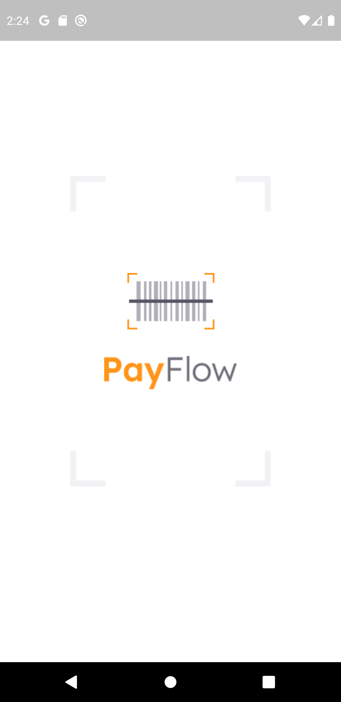
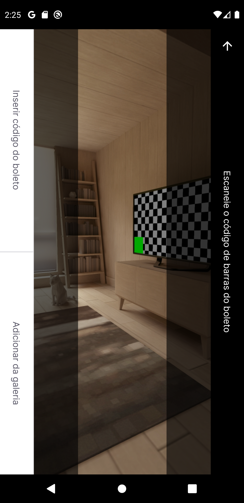

# Pay Flow

# Sobre o Projeto
O Pay Flow é um aplicativo desenvolvido em Flutter para gerenciamento de boletos. O projeto foi desenvolvido durante o Next Level Week Together da Rocketseat. Foi um projeto desafiador cheio de coisas interessantes e algumas bem complexas. É um aplicativo simples, mas muito bonito (como todos criados em Flutter :rofl::rofl:) onde as telas seguiram à risca o layout.    

# Layout

         

# Funcionamento

Em primeiro lugar é preciso realizar o login para ter acesso ao app. Uma vez logado o usuário pode cadastrar um novo boleto, visualizar os boletos que ainda não foram pagos e visualizar os boletos que já foram pagos. Para cadastrar o boleto é utilizado a câmera que pode ler o código de barras, também pode ser inserido tudo de forma manual.

Foram utilizados diversos recursos como Splash Screen, login com Google, Firebase Core, Machine Leaning com ML Kit, aimações e estilizações personalizadas, SharedPreferences para salvar as informações, gerencia de estados com ValueNotifier e estrutura de projeto MVC.

# Objetivo

O objetivo do desenvolvimento deste projeto foi aprofundar ainda mais os conhecimentos sobre Flutter, principalmente com a utilização de novos recursos como o login com Google e a utilização da câmera para ler boletos.

# Como Utilizar?

~~~
- Clonar o repositório:
$ git clone https://github.com/murilobohlke/pay-flow

- Entrar no diretório:
$ cd pay-flow/payflow

- É preciso ter a chave de API do Firebase, com o arquivo .json gerado é preciso colar ele na pasta Android/App.

- Instalar as dependências:
$ flutter pub get

- Iniciar o app: 
$ flutter run
~~~

# Tecnologias Utilizadas
- Flutter
- Shared Preferences
- Firebase
- Google Sing In
- Google ML Kit
- Animated Card

# Autor
Murilo Steinmetz Böhlke

https://www.linkedin.com/in/murilobohlke/
